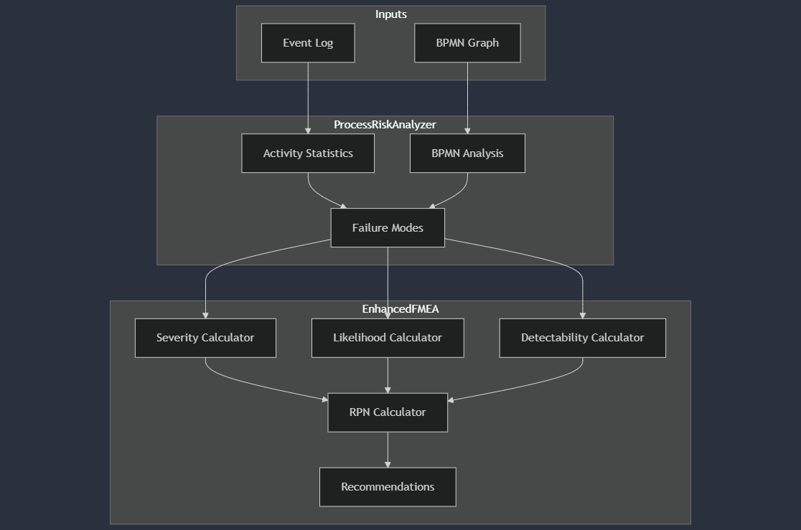
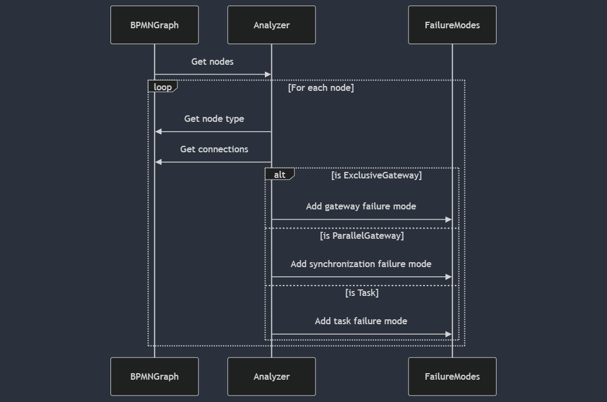
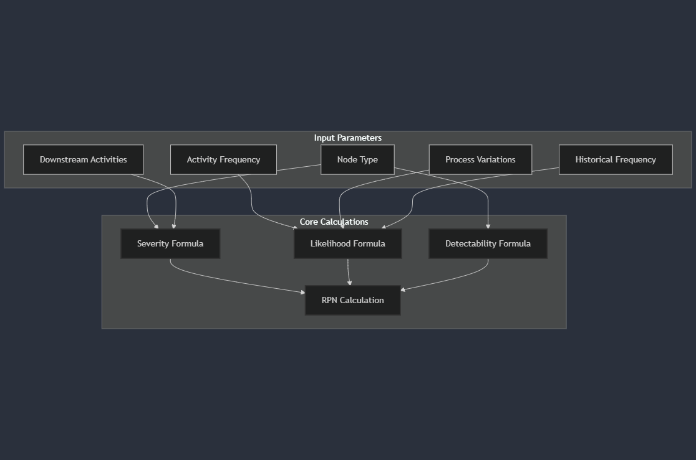

# 1. Core Components
The risk analysis system consists of two main classes:

### ProcessRiskAnalyzer: Analyzes BPMN process and generates failure modes
### EnhancedFMEA: Performs risk assessment on identified failure modes




# 2. Activity Statistics Calculation

Let's examine how the ProcessRiskAnalyzer computes activity statistics:

```python
def _compute_activity_statistics(self) -> Dict:
    """Compute statistics about activities from event log"""
    stats = defaultdict(lambda: {
        'frequency': 0,          # Number of times activity occurs
        'duration': [],          # List of activity durations
        'variations': set(),     # Set of preceding activities
        'completion_rate': 0     # Percentage of successful completions
    })

    for trace in self.event_log:
        previous_activity = None
        for event in trace:
            activity = event['concept:name']
            stats[activity]['frequency'] += 1
            if previous_activity:
                stats[activity]['variations'].add(previous_activity)
            previous_activity = activity

    return dict(stats)
```

Key Metrics:

Frequency: How often each activity occurs
Process Variations: Which activities precede others
Duration tracking (prepared but not used in current implementation)
Completion rate tracking (prepared but not used in current implementation)


# 3. BPMN Analysis for Failure Modes

The analyzer examines each node in the BPMN graph:



# 4. Risk Calculations Using EnhancedFMEA



### Historical Frequency Calculation:

For Gateways:

```textmate
Gateway_Failure_Prob = 0.3 * (num_incoming + num_outgoing) / 4
  where:
  - 0.3 is base probability
  - num_incoming = count of incoming paths
  - num_outgoing = count of outgoing paths
  - 4 is normalization factor
```

Complexity Factor:

```textmate
Complexity_Factor = len(process_variations) / max_variations
  where:
  - process_variations = unique preceding activities
  - max_variations = normalization constant (10 in code)
```

### Severity Calculation:

Severity Score Formula

```textmate
Final_Severity = min(Base_Severity * (1 + Impact_Factor), 10)

where:

Base_Severity = 
    - Task: 5
    - SubProcess: 7
    - ExclusiveGateway: 6
    - ParallelGateway: 4
    - ComplexGateway: 8

Impact_Factor = Number_of_Downstream_Activities / 5
```

Example Calculation:
For a Task with 3 downstream activities:

```textmate
Base_Severity = 5
Impact_Factor = 3/5 = 0.6
Final_Severity = min(5 * (1 + 0.6), 10)
                = min(5 * 1.6, 10)
                = min(8, 10)
                = 8
```

### Likelihood Calculation:

```textmate
Final_Likelihood = min(Base_Likelihood * (1 + Variation_Factor), 10)

where:

Base_Likelihood = Historical_Frequency * 10

Variation_Factor = Number_of_Process_Variations / 10
```
Example Calculation:
For a task with:

Historical failure rate: 0.3
4 process variations:

```textmate
Base_Likelihood = 0.3 * 10 = 3
Variation_Factor = 4/10 = 0.4
Final_Likelihood = min(3 * (1 + 0.4), 10)
                 = min(3 * 1.4, 10)
                 = min(4.2, 10)
                 = 4
```

### Detectability Calculation:

Detectability Score Formula

```textmate
Final_Detectability = max(min(Base_Detectability - Frequency_Adjustment, 10), 1)

where:

Base_Detectability =
    - Task: 3
    - SubProcess: 5
    - ExclusiveGateway: 7
    - ParallelGateway: 4
    - ComplexGateway: 8

Frequency_Adjustment = 
    2 if activity_frequency > 100
    0 otherwise
```

Example Calculation:
For a high-frequency Task:

```textmate
Base_Detectability = 3
Frequency_Adjustment = 2 (since frequency > 100)
Final_Detectability = max(min(3 - 2, 10), 1)
                   = max(min(1, 10), 1)
                   = 1
```


### Final RPN (Risk Priority Number) Calculation:

Risk Priority Number (RPN) Formula


```textmate
RPN = Severity * Likelihood * Detectability

Risk Levels based on RPN:
- High Risk: RPN > 200
- Medium Risk: 100 < RPN ≤ 200
- Low Risk: RPN ≤ 100

Example Complete Calculation:
For a high-frequency task with 3 downstream activities and 4 variations:

1. Severity = 8 (from previous calculation)
2. Likelihood = 4 (from previous calculation)
3. Detectability = 1 (from previous calculation)

RPN = 8 * 4 * 1 = 32 (Low Risk)
```

Risk Level Distribution

```textmate
Maximum possible RPN = 10 * 10 * 10 = 1000
Minimum possible RPN = 1 * 1 * 1 = 1

Risk Level Percentiles:
- High Risk (>200): Top 20% of range
- Medium Risk (100-200): Middle 30% of range
- Low Risk (<100): Bottom 50% of range
```