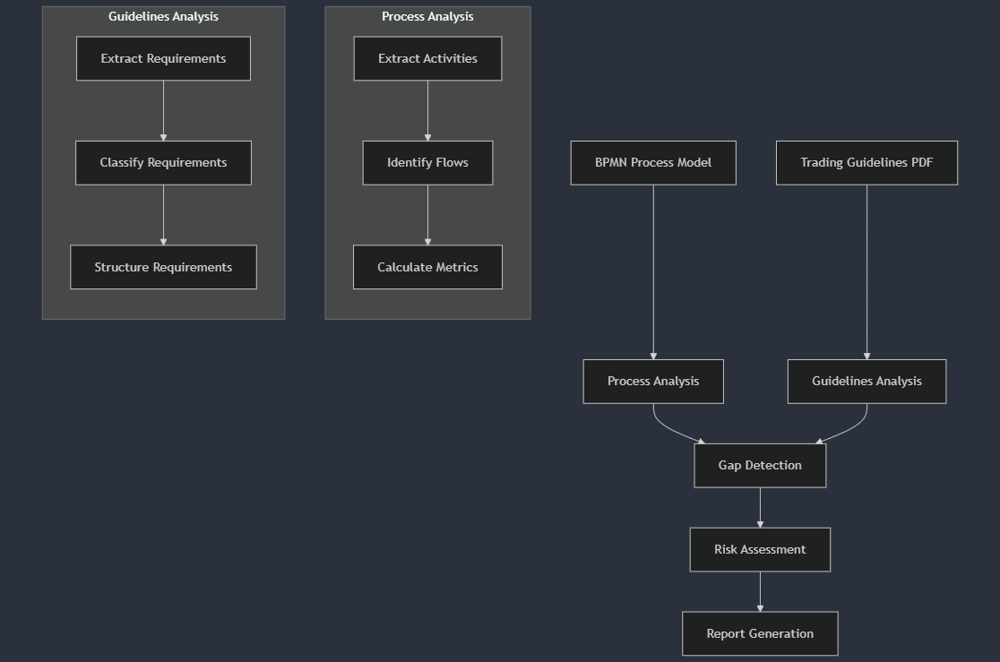
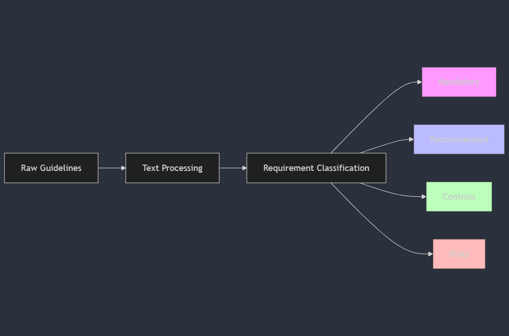
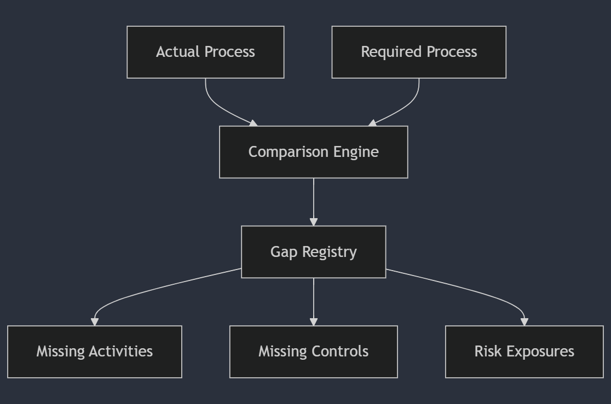

# Understanding Process Mining & Gap Analysis in FX Trading
## A Comprehensive Guide

## Table of Contents
1. [Introduction](#introduction)
2. [Process Overview](#process-overview)
3. [Key Components](#key-components)
4. [Detailed Analysis Steps](#detailed-analysis-steps)
5. [Risk Assessment Framework](#risk-assessment-framework)
6. [Worked Example](#worked-example)
7. [Common Scenarios](#common-scenarios)
8. [Best Practices](#best-practices)

## Introduction

This guide explains how we analyze gaps between actual FX trading processes and regulatory guidelines. Think of it as comparing a restaurant's actual cooking practices against health and safety regulations - we're looking for where reality might not match requirements.

## Process Overview



## Key Components

### 1. Process Model Analysis
- **Input**: BPMN (Business Process Model Notation) diagram
- **Output**: Structured activity map with:
  - Activity counts (found 35 in example)
  - Gateway counts (30 in example)
  - Flow connections (111 in example)

Think of this as creating a detailed map of a city's road system, where:
- Activities = Buildings
- Gateways = Intersections
- Flows = Roads

### 2. Guidelines Analysis


Requirements are classified into:
1. **Mandatory Activities** (Must/Shall statements)
2. **Recommended Activities** (Should statements)
3. **Controls** (Verify/Monitor statements)
4. **Risks** (Risk/Exposure statements)

## Detailed Analysis Steps

### Step 1: Process Extraction


### Step 2: Guidelines Parsing
The system uses Natural Language Processing to understand guidelines:

1. **Sentence Segmentation**: Break text into sentences
2. **Keyword Detection**: Look for key terms like "must", "should", "verify"
3. **Action Extraction**: Identify required actions using verb analysis
4. **Object Identification**: Determine what the action applies to

Example transformation:
```
Raw: "Management must actively monitor system usage"
↓
Structured: {
  "action": "monitor",
  "objects": ["system usage"],
  "type": "mandatory",
  "context": "management responsibility"
}
```

### Step 3: Gap Detection



## Risk Assessment Framework

The system employs a modified FMEA (Failure Mode and Effects Analysis) approach:

### Risk Scoring Formula
```
Risk Priority Number (RPN) = Severity × Likelihood × Detectability

Where:
- Severity (1-10): Impact of failure
- Likelihood (1-10): Probability of occurrence
- Detectability (1-10): Ability to detect before impact
```

Example calculation:
- Missing compliance check:
  - Severity: 8 (High regulatory impact)
  - Likelihood: 6 (Moderate chance of occurring)
  - Detectability: 4 (Fairly detectable)
  - RPN = 8 × 6 × 4 = 192

## Worked Example

Let's work through a real finding from the analysis:

### Found Gap: Trade Validation
```
Actual Process: Trade Execution → Settlement
Required Process: Trade Execution → Validation → Settlement
```

Risk Assessment:
1. **Severity** = 8 (Can lead to significant losses)
2. **Likelihood** = 7 (High chance of missing validation)
3. **Detectability** = 5 (Moderate detection difficulty)
4. **RPN** = 8 × 7 × 5 = 280 (High risk)

## Common Scenarios

1. **Missing Control Activity**
   - Example: No KYC check before trade
   - Impact: Regulatory non-compliance
   - Detection: Review of mandatory checkpoints

2. **Incomplete Flow**
   - Example: Missing confirmation step
   - Impact: Settlement risk
   - Detection: Process flow analysis

3. **Insufficient Monitoring**
   - Example: No real-time position monitoring
   - Impact: Market risk exposure
   - Detection: Control point audit

## Best Practices

1. **Regular Reviews**
   - Conduct gap analysis quarterly
   - Update process models after changes
   - Validate findings with business users

2. **Risk Prioritization**
   - Focus on high RPN items first
   - Group related gaps
   - Track remediation progress

3. **Documentation**
   - Maintain clear gap registers
   - Document remediation plans
   - Keep audit trails of changes

The provided analysis found:
- 35 actual activities
- 12 missing mandatory requirements
- 23 control gaps
- Multiple risk exposure points

Each gap is documented with:
- Context from guidelines
- Impact assessment
- Recommended actions

This structured approach ensures comprehensive coverage while prioritizing the most critical gaps for remediation.